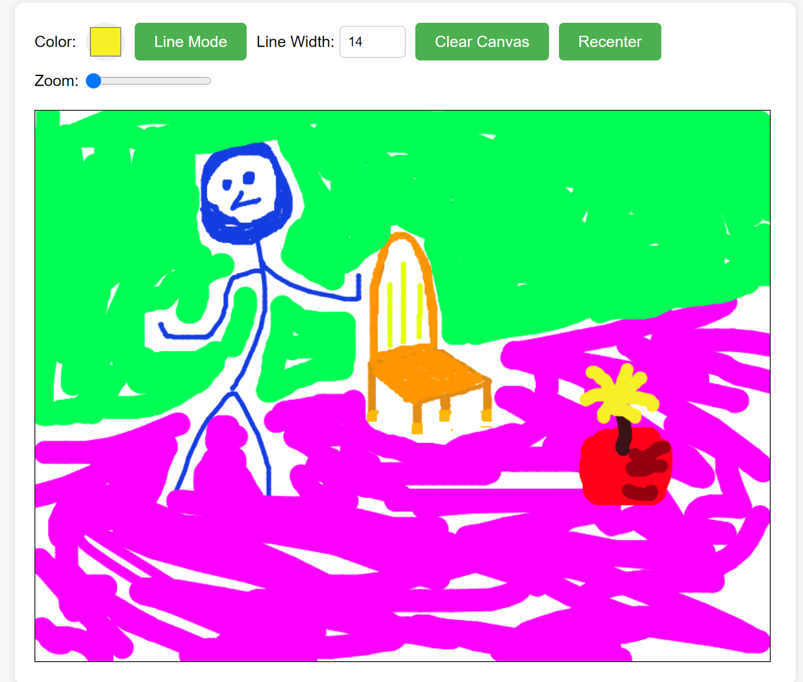

# Canvas drawing interface pure JS web component

Add it to the page:
```html
<canvas-with-controls></canvas-with-controls>
<script src="CanvasWithControls.js"></script>
```
Extends HTMLElement natively.

This is mostly a primitive for building on top of.

By default this works by fetching the html and css files associated on first run, comment out the Promise.all fetch for the imports if you are using a bundler instead.

## Test
Serve the index.html from this folder to test the component out.



GPT 3.5 wrote it, I mostly just prompted.